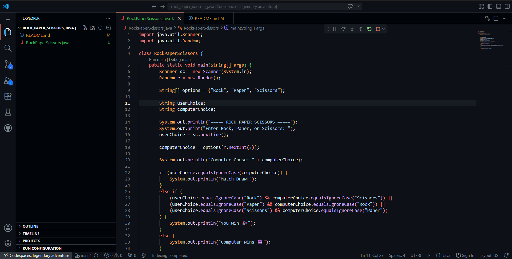
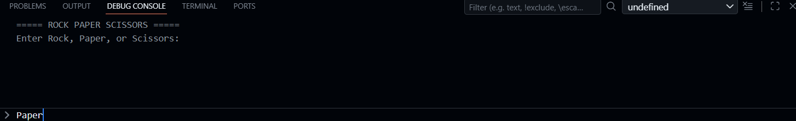
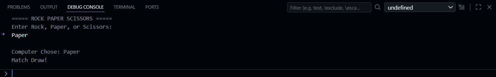

# 🪨📄✂️ Rock Paper Scissors - Java

A simple command-line Rock Paper Scissors game built in Java.

## 🎮 How to Play

1. Run the program
2. Enter `Rock`, `Paper`, or `Scissors` when prompted
3. The computer randomly picks its choice
4. The winner is announced!

## 🕹️ Game Rules

| Your Choice | Beats |
|-------------|-------|
| 🪨 Rock     | Scissors |
| 📄 Paper    | Rock |
| ✂️ Scissors | Paper |

- Same choice = **Draw**
- Better choice = **You Win 🎉**
- Worse choice = **Computer Wins 😈**

## 🚀 Getting Started

### Prerequisites

- Java JDK 8 or higher installed
- A terminal or command prompt

 

## 📸 Sample Output

```
===== ROCK PAPER SCISSORS =====
Enter Rock, Paper, or Scissors: Rock
Computer Chose: Scissors
You Win 🎉
```

## 🛠️ Built With

- Java (Core)
- `java.util.Scanner` — for user input
- `java.util.Random` — for computer's random choice


## 🖥️ Screenshots

### 🎮 Editor Screen


### 👤 User Choice


### 🏆 Result


---

## 📁 Project Structure

```
rock-paper-scissors-java/
│
├── RockPaperScissors.java   # Main game file
└── README.md                # Project documentation
```

 
